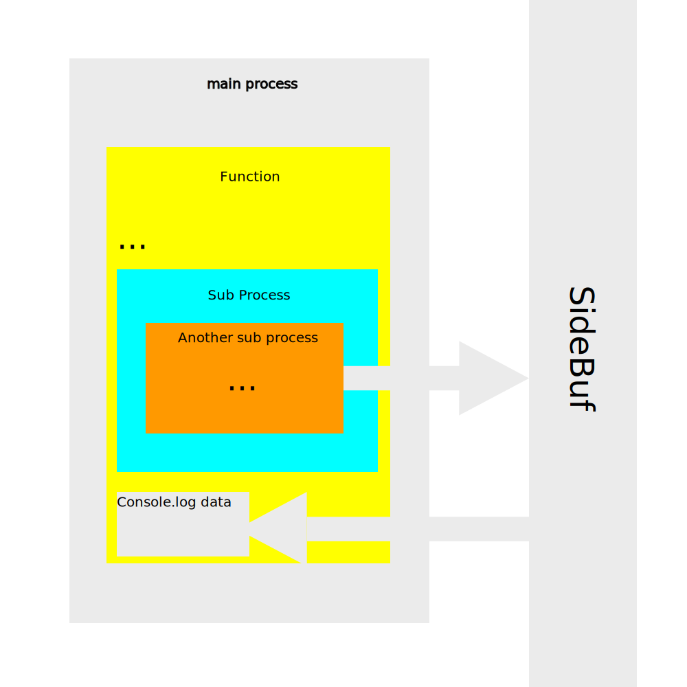

<div align="center">
  
# SideBuf
A JavaScript side buffer

</div>
SideBuf, for side buffer, is a side buffer that will help you exporting data independently from the process or the context. In other words, if you have a function in a function, in another function that returns the data you want, instead of putting the keyword `return` each time you have another function, you simply export this data with SideBuf, and get it back in the main process. Here is how it should work:



# How to use it?
First, install it:
- Browser:
```html
<script src="https://unpkg.com/sidebuf"></script>
```
- node
```bash
npm i sidebuf
```

Then, use it like:
```js
// getting the sidebuf object
const sidebuf = new SideBuf() // for node, use require('sidebuf')

sidebuf.push(name, value) // set a new value

sidebuf.pull(name) // get the value from name

sidebuf.tmp(name, value) // similar as sidebuf.push, but will destroy itself 10 seconds after

sidebuf.reset() // reset every values in the cache

sidebuf.clear(name) // deletes a value from its name
```

© Arthur Guiot 2017
